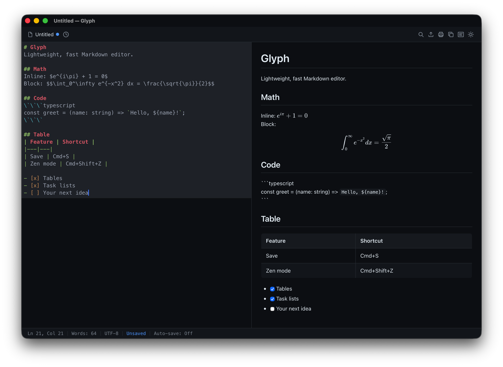

# Glyph

A lightweight, fast Markdown editor built with [Tauri v2](https://v2.tauri.app), React, and CodeMirror 6. Native desktop app with a ~8MB binary.




## Features

- **Split-pane editing** — write markdown on the left, live preview on the right
- **WYSIWYG inline mode** — Typora-style editing where markdown syntax renders in-place with cursor-reveal
- **Syntax highlighting** — Shiki-powered code blocks across 9+ languages
- **LaTeX math** — inline `$…$` and block `$$…$$` rendered via KaTeX
- **GFM support** — tables, task lists, footnotes, strikethrough
- **Find & replace** — full-featured search via `Cmd+F`
- **Recent files** — quick access to your last-edited documents
- **Auto-save** — background saves so you don't lose work
- **Zen mode** — distraction-free writing, toggled with `Cmd+Shift+Z`
- **Image preview** — inline image thumbnails in the editor
- **Export & share** — HTML export, PDF via print, and copy-as-rich-text for pasting into other apps
- **Themes** — light, dark, and system-aware
- **File associations** — double-click `.md` / `.markdown` / `.mdown` / `.mkd` files to open in Glyph
- **Drag & drop** — drop markdown files onto the editor
- **Unsaved changes protection** — confirm before closing with unsaved work

## Keyboard shortcuts

macOS uses `Cmd`; Linux and Windows use `Ctrl`.

| Shortcut | Action |
| --- | --- |
| `Cmd+S` | Save |
| `Cmd+Shift+S` | Save As |
| `Cmd+O` | Open file |
| `Cmd+B` | Bold |
| `Cmd+I` | Italic |
| `Cmd+K` | Insert link |
| `Cmd+F` | Find & replace |
| `Cmd+Shift+E` | Export as HTML |
| `Cmd+P` | Print / Export PDF |
| `Cmd+Shift+C` | Copy as rich text |
| `Cmd+Shift+Z` | Toggle zen mode |
| `Esc` | Exit zen mode |

## Tech Stack

| Layer    | Technology                          |
| -------- | ----------------------------------- |
| Backend  | Tauri v2 (Rust)                     |
| Frontend | React 19 + Vite 7                   |
| Editor   | CodeMirror 6                        |
| Markdown | markdown-it + Shiki + KaTeX         |
| Styling  | Vanilla CSS with CSS Modules        |

## Getting Started

Prebuilt releases will appear on the [GitHub Releases page](https://github.com/itzAditya0/Glyph/releases) once tagged. Until then, build from source:

### Prerequisites

- [Node.js](https://nodejs.org/) (v18+)
- [Rust](https://www.rust-lang.org/tools/install)
- [Tauri prerequisites](https://v2.tauri.app/start/prerequisites/) for your platform

### Build from source

```bash
# Install dependencies
npm install

# Run in development mode (browser only)
npm run dev

# Run as native desktop app
npm run tauri dev

# Build a release binary
npm run tauri build
```

The built app will be in `src-tauri/target/release/bundle/`.

## Project Structure

```
src/
  components/     # React components (Editor, Preview, Toolbar, StatusBar)
  extensions/    # CodeMirror extensions (WYSIWYG inline rendering)
  hooks/          # React hooks (useFile, useMarkdown, useTheme)
  styles/         # Global CSS and design tokens
  utils/          # Export helpers, formatters
src-tauri/
  src/            # Rust backend (file I/O commands)
```

## Roadmap

Ideas on the horizon (not promises):

- Plugin API for custom markdown extensions
- Vim keybindings mode
- Frontmatter-aware preview (YAML metadata)
- Multi-file workspace / folder tree
- Syncable settings

## Contributing

Issues and pull requests are welcome. See [CONTRIBUTING.md](CONTRIBUTING.md) for how to run Glyph locally and report bugs.

## Recommended IDE Setup

- [VS Code](https://code.visualstudio.com/) or [Zed](https://zed.dev/) with the [Tauri extension](https://marketplace.visualstudio.com/items?itemName=tauri-apps.tauri-vscode) and [rust-analyzer](https://marketplace.visualstudio.com/items?itemName=rust-lang.rust-analyzer).

## License

MIT — see [LICENSE](LICENSE).
